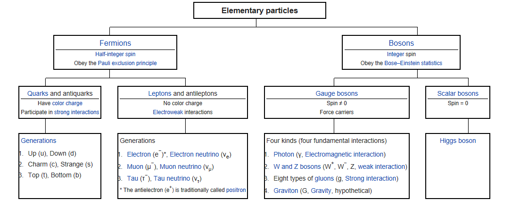

<h1 style="text-align:center">Problem 3</h1>
<h3 style="text-align:center">Focused on OOPs</h3>
<br>

## 1.  Make Trinary Group
<p style="text-align:right">Provided by <b>Tae Geun Kim</b></p>

### 1) Prepare Class
* Make Trinary Class (or Type) 
    * There are only 3 distinguishable elements {a, b, c} (like {0,1,2})

### 2) Define Methods
* Add : a+b=c, b+c=a, c+c=b and etc.
* Multiply : ab=a, bc=c, c^2=b and etc.
* Square : Same as Multiply.
* String : ```A=Trinary{2(or b)}; Print(A) -> 2 (or b) [Trinary]```

### 3) Example Code (Main)
``` Go
func main() {
    A, B, C := Trinary{0}, Trinary{1}, Trinary{2}
    Print(A.Add(B)) // Output: 1 [Trinary]
    Print(C.Square()) // Output: 2 [Trinary]
    // If Possible, you can make as follows:
    Print(A + B) // Output: 1 [Trinary]
    Print(C^2) // Output: 2 [Trinary]
}
```
<br>

## 2. Basic Particle Physics
<p style="text-align:right">Provided by <b>Tae Geun Kim</b></p>

</img>

### 1) Prepare Class (or Type)
* Make Particle class (or Type)
    * Default particle class has name, mass, charge, spin
* Make Fermion Class (or Type). If possible, inherit default particle class
* Make Boson Class (or Type). If possible, inherit default particle class
(Hint : Fermion - spin:half-integer, Boson - spin:integer)

### 2) Define Methods for Class (or Type)
* String (or ```__str__```) : Print(particle) -> Name: electron, Mass: blabla..
* Name : You can assign name for empty "Particle" class.
ex) ```var A Particle; A.Name("electron")``` or ```A = Particle(); A.Name("electron")```
* Charge : Same as Name
* Mass : Same as.
* Spin : Watch out! Boson allows only integer spin and Fermion allows only half integer spin.

### 3) Play with Instance
* Declare electron as instance of Fermion class and print this.
(Print(A) -> Name: "electron", Charge: -1, Mass: 0.51MeV, Spin: 1/2)

### 4) Example Code (Main)
```Go
func main() {
    var A Fermion
    A.Name('electron'); A.Mass(0.51 * 1e+06); A.Charge(-1); A.Spin(1/2)
    Print(A) 
    //Output: 
    //  Name: "electron"
    //  Type: Fermion
    //  Mass: 0.51MeV
    //  Charge: -1
    //  Spin: 1/2
}
```
<br>

